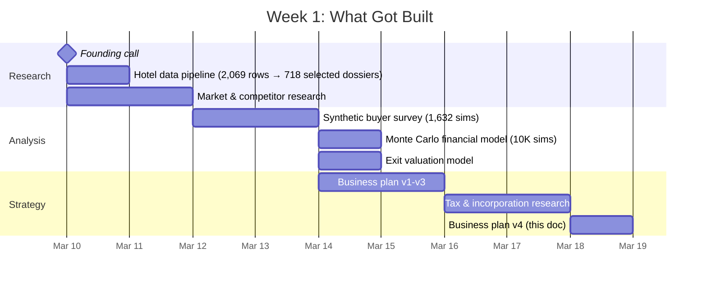
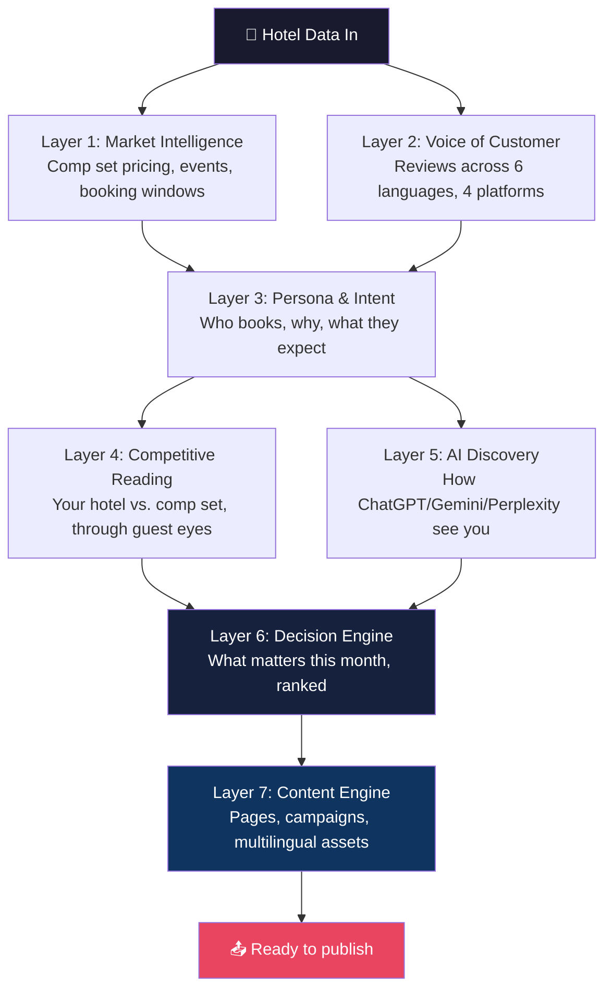
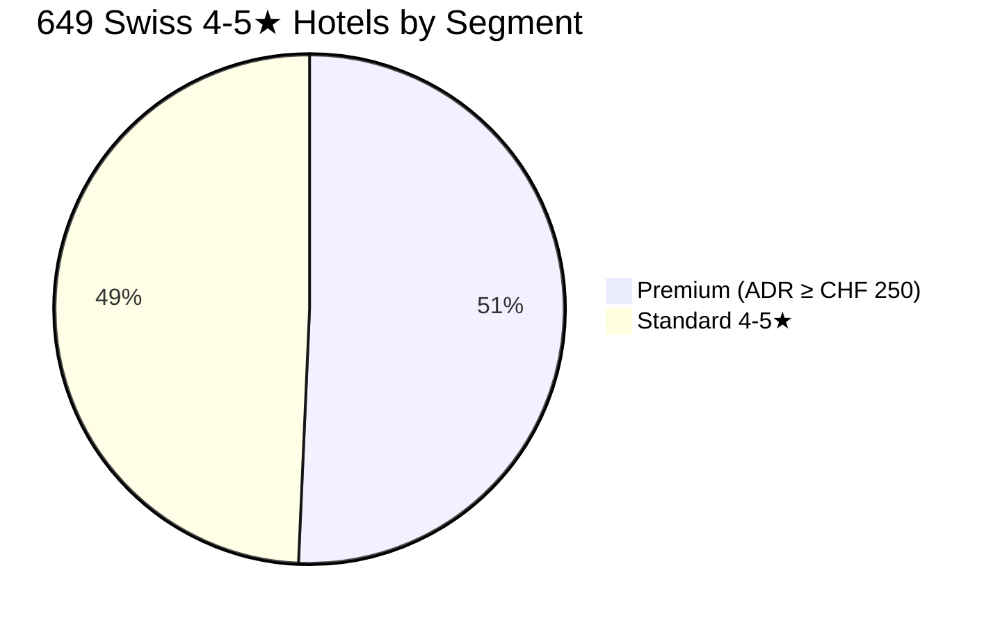
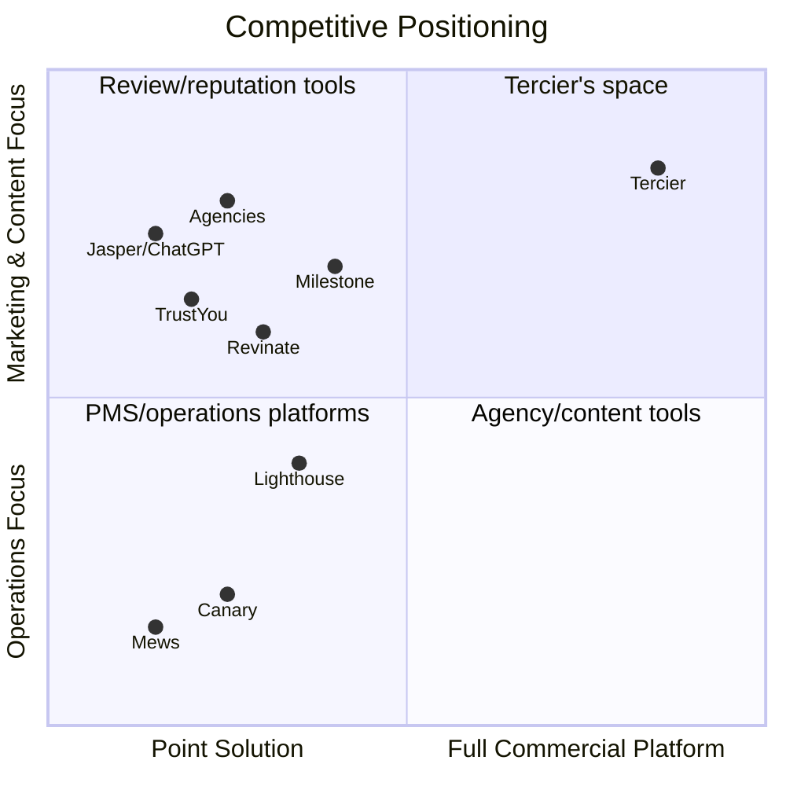
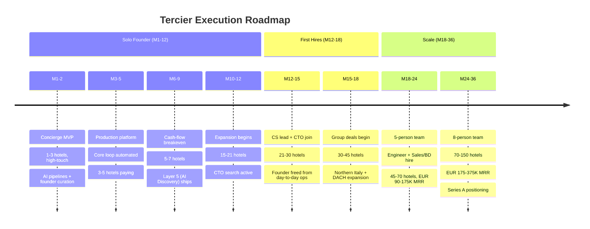
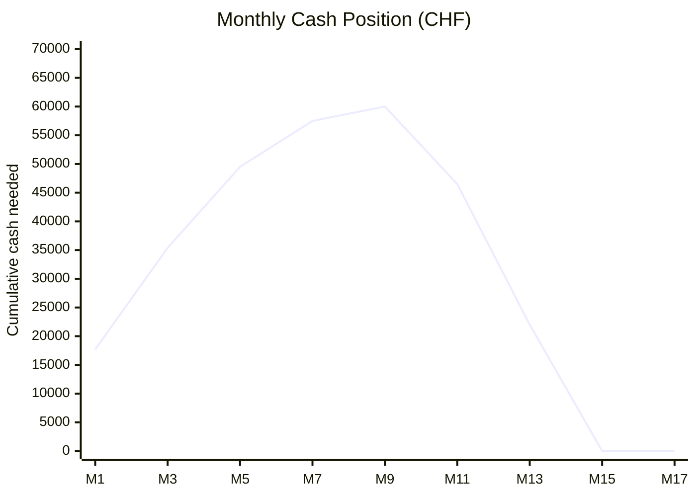
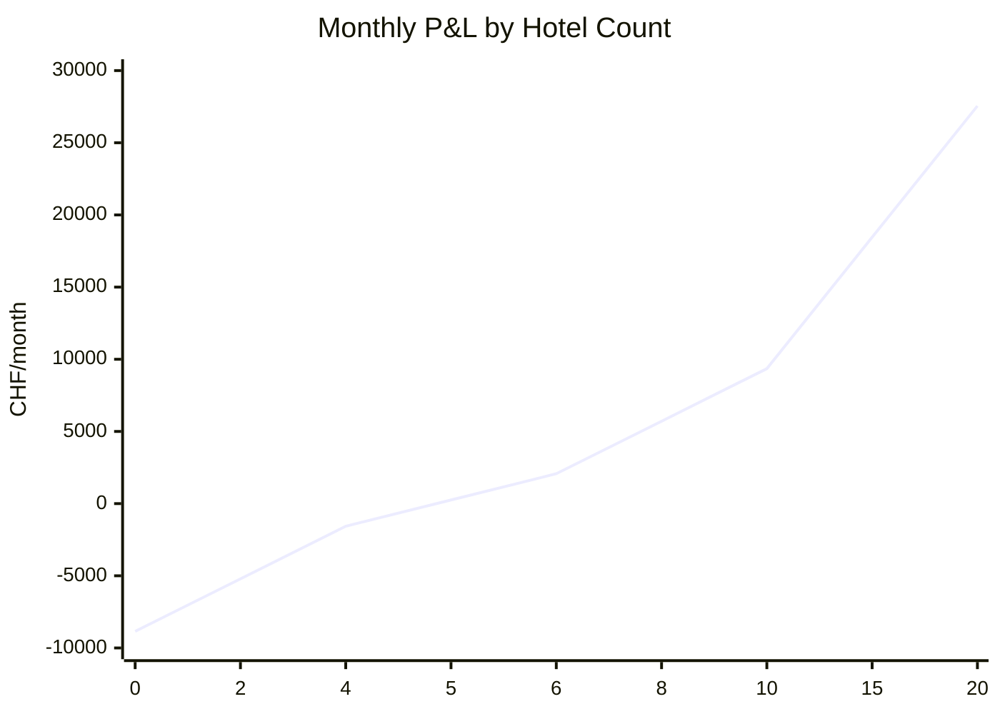
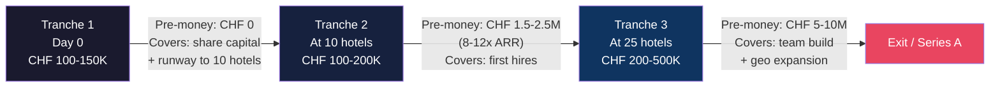
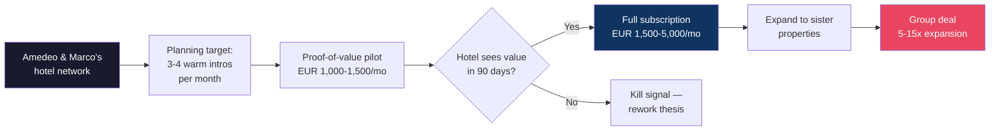
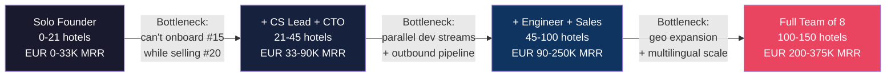

# Tercier — Business Plan v4

**March 2026 | Confidential**
Marco Di Cesare, Founder & CEO
Tercier AG | Zug, Switzerland | tercier.ai

*Prepared for Amedeo Guffanti and Marco Corsaro*

---

## What I did in one week

You called me on March 10. Nine days later, this is what exists:

- A Swiss hotel data pipeline built from 2,069 HotellerieSuisse member rows, narrowed to 718 selected dossiers and filtered to 272 premium properties (4-5 star, ADR ≥ CHF 250)
- A synthetic buyer survey: 1,632 interview simulations across those 272 hotels — 2 roles × 3 replications each, then adversarial critique and judge normalization — testing willingness to pay, objections, and deal-breakers
- A Monte Carlo financial model: 10,000 simulations producing P50 projections of 115-154 hotels and EUR 3.99M-5.33M ARR at month 36 across operator-seeded and follow-on-angel paths
- A competitive landscape with current pricing, funding, and category-movement checks
- A tax-optimized corporate structure (Zug AG, not Zurich — roughly 7.8 percentage points lower corporate tax)
- This business plan

This is what I personally produced in nine days with AI tools: the research stack, synthetic survey, financial modeling, and business-plan system in this repo. That is also the operating leverage the company can deliver for hotels.

---

## The opportunity in one paragraph

A premium hotel generating EUR 15-70M in revenue has a marketing department of one person who speaks two languages. That person handles everything from Instagram to the welcome message on the TV. Agencies deliver generic content for EUR 3,000-8,000/month that reads the same for every property. Meanwhile, 37% of travelers now use AI to plan trips (BCG/NYU, March 2026), and 55% of AI hotel citations come from OTAs — not from the hotel itself (Cloudbeds). The hotel is losing control of its own story at the exact moment travelers are making decisions. No tool exists that reads the market around a property, understands its guests, and ships targeted multilingual content fast enough to matter. That's Tercier.

---

## What Tercier does

The platform gives each hotel the operating capacity of a stronger commercial team — without adding headcount. It reads the market, the guests, the competitors, and the way the property appears in AI answers. Then it decides what matters now and drafts what the team needs to ship.

**The AI does:** read, analyze, decide, draft.
**The human does:** review, adjust, approve, publish.

The marketing person stops being a researcher, writer, and translator. They become an editor.

### The demo that closes the sale

Amedeo sits with the Commercial Director at a Zurich five-star. He doesn't show a dashboard. He shows her hotel's website through the eyes of a German business traveler — side by side with Park Hyatt. She sees where she's under-explaining what Germans care about (parking, spa, efficient check-in), where Park Hyatt is clearer, which proof points from her own reviews she's not using. Then the platform switches to a Chinese honeymooner. Her site has no Chinese content. The competitor does. That's the moment she leans forward.

*"We will show you your own hotel through the eyes of your most valuable guest, next to the hotel that is beating you for that guest. Fifteen minutes. If you don't see something you didn't know, we stop there."*

---

## The market we're going after

### Swiss beachhead

329 premium hotels. Geographic clusters: Zermatt (54), Zurich (48), Geneva (32), Basel (21), Lucerne (18), St. Moritz (13). 77 have named GMs. 99% have contact emails. Dense, high-value, multilingual, and reachable.

### What the synthetic survey says

We simulated buying conversations with 272 of these hotels — 2 buyer roles, 3 replications each, followed by adversarial critique and judge normalization. Key findings:

- **37% average buy likelihood** at CHF 3,000/mo
- **Top deal killer:** No PMS/CRM integration (79%)
- **Sweet spot pricing:** CHF 2,000-3,500/mo for full platform
- **Top proof-package items:** PMS/CRM integration, Swiss reference, 60-day pilot, Swiss/GDPR-compliant hosting

### Market sizing

| Scope | Hotels | ACV | Value |
|-------|--------|-----|-------|
| **Global TAM** (premium 4-5★) | 55-75K | EUR 24-36K | EUR 1.3-2.7B |
| **European SAM** | 6-8K | EUR 24-36K | EUR 144-288M |
| **36-month target** | 115-154 | EUR 34-35K | EUR 4.0-5.3M ARR |

---

## Competitive landscape

Nobody does what Tercier does. Competitors own pieces — nobody orchestrates.

| Player | What they do | What they miss |
|--------|-------------|----------------|
| **Mews** ($2.5B, 15K hotels) | Cloud PMS, payments | Operations-focused. Different buyer, different budget. |
| **Canary** ($600M, 20K+ hotels) | AI guest management, check-in | PMS-centric. No content, no commercial intelligence. |
| **Lighthouse** (65K hotels) | Rate intelligence, revenue mgmt | Pricing and ranking. No content execution. |
| **TrustYou** ($115-350/mo) | Review aggregation, sentiment | Gives a 4.3 score. Doesn't tell you what to do about it. |
| **Agencies** (EUR 3-8K/mo) | Generic content, social | Late, monolingual, same for every property. |

**Tercier's wedge:** property-level commercial intelligence + content execution in one system. The value is in the orchestration — reviews feed personas, personas guide competitive reading, competitive reading drives priorities, priorities drive content.

---

## Business model

### Pricing

| Tier | Per property/month | What they get |
|------|-------------------|---------------|
| **Proof of Value** (90 days) | EUR 1,000-1,500 | Market signals, personas, competitive reading, AI discovery audit |
| **Intelligence** | EUR 1,500-2,500 | Full platform, monthly commercial brief |
| **Intelligence + Content** | EUR 2,500-5,000 | All above + multilingual content engine, campaign assets |
| **Group rollout** (5+ properties) | EUR 2,000-4,000/property | Portfolio reporting, cross-property benchmarking |

### Why they'll pay

- **vs. agency:** EUR 2,500-5,000/mo for better output vs. EUR 3-8K/mo for generic work
- **vs. hiring:** Platform = EUR 30-60K/yr. Equivalent team = EUR 180-300K/yr.
- **vs. OTA commissions:** Shifting 5% of bookings from OTA to direct at a EUR 25M hotel saves EUR 112K/yr. Platform costs EUR 30-60K/yr. 2-4x ROI from commission savings alone.

### Unit economics

Per-customer COGS (modeled LLM inference + data + APIs): **EUR 15-50/hotel/month**, or roughly 1-5% of revenue depending on tier and usage.

**Gross margin: >95% at any scale.**

---

## The plan

### How it works with one person

This is not a team of 30. It is a solo founder/operator using AI tools to ship at the velocity of a 3-5 person early team. The proof in this repo is the research, knowledge system, survey pipeline, modeling, and documentation produced in nine days. That is distinct from claiming sole authorship of every pre-existing prototype asset from zero.

The first 5-10 hotels don't need a company. They need a founder who can sit with a commercial director, understand what she needs, walk back to the laptop, and build it that afternoon. That customer-to-feature loop — hours, not sprints — is impossible with a team.

### What hotel number one gets in 30 days

**Week 1:** Platform ingests reviews (Booking, Google, TripAdvisor, Expedia), maps the comp set, builds initial personas. No PMS needed. The team receives a competitive reading: how the property stacks up through the eyes of each guest segment.

**Week 2-3:** First deliverables ship. A persona-targeted landing page draft. An AI discovery audit — how ChatGPT, Gemini, Perplexity see the property, and where the narrative breaks. A multilingual content brief for the next campaign.

**Week 4:** Monthly commercial brief: what changed, which segments are moving, what the comp set published, what to prioritize next 30 days. The marketing person goes from "researching what to do" to "reviewing and approving what's already drafted."

---

## The money

### Tercier AG — incorporated in Zug

Zug, not Zurich. Corporate tax: **11.8%** vs. 19.6% in Zurich. Same country, same credibility, 8 percentage points saved on every franc of profit. The crypto and fintech ecosystem in Zug also provides a startup-friendly administrative environment.

### The real cost (hardened, conservative)

| Category | Monthly (CHF) | Annual (CHF) |
|----------|--------------|-------------|
| Admin & legal (Treuhand, legal, insurance, governance) | 1,625 | 19,500 |
| Office (coworking Zurich + internet) | 625 | 7,500 |
| Tech infrastructure (hosting, DB, cache, monitoring) | 390 | 4,680 |
| AI dev tooling (Claude Code, Codex, Perplexity, Cursor) | 540 | 6,480 |
| Marketing (LinkedIn, travel, content, events, CRM) | 1,350 | 16,200 |
| **Total OPEX (no salary)** | **4,530** | **54,360** |
| Founder salary (CHF 4,000/mo gross) | 4,000 | 48,000 |
| Employer social contributions | 320 | 3,840 |
| **Total monthly burn** | **8,850** | **106,200** |

One-time costs: CHF 7,600 (incorporation CHF 3K + MacBook CHF 3.4K + tercier.com domain CHF 1.2K)

These aren't optimistic estimates. They include real marketing spend (CHF 1,350/mo for LinkedIn, client travel, content production, small events) and high-end admin costs.

### How much cash the company actually needs

Here's the month-by-month reality, conservatively assuming 12 months to reach 10 hotels:

**Peak cash deficit: ~CHF 60,000** at month 9. That's the most money the company ever needs before revenue catches up. By roughly month 15, the deficit is repaid from revenue. After that, the company is generating surplus cash every month.

### What this means: CHF 120-150K is enough

> X = Share capital (CHF 100K, stays on company account) + Peak deficit (~CHF 60K) + Buffer
> X = CHF 120-150K

I'm not asking for CHF 200K because the company doesn't need CHF 200K. It needs CHF 120-150K. Asking for more than the math supports would mean either I haven't done the homework or I'm padding for comfort. I've done the homework.

If you want more buffer — or if you want to fund a second person from day 1 (adds CHF 4,300/mo, pushing peak deficit to roughly CHF 100K and X to CHF 170-190K) — that's your call. The formula stays the same.

### Salary: CHF 4,000/mo — and why

I'm currently at CHF 120K/yr. My market rate is CHF 200-250K for what I do. I'm taking CHF 48K. That's a CHF 152K/yr sacrifice — CHF 456K over 3 years.

That sacrifice IS my investment. You put in cash. I put in time at below-market salary. Both are real.

| Salary | Monthly burn | Runway (0 revenue) | Net take-home |
|--------|-------------|-------------------|---------------|
| **CHF 4,000/mo** | CHF 8,850 | 16 months | CHF 3,579/mo |

Below BVG pension threshold = 14% savings in pension contributions. Defensible for a pre-revenue startup CEO. When we have 10 paying hotels, salary bumps automatically.

### Breakeven

Monthly fixed costs: CHF 8,850. At EUR 1,500/mo proof-of-value pricing (CHF ~1,365/mo), **breakeven = 7 hotels**. At EUR 2,000/mo full pricing (CHF ~1,820/mo), **breakeven = 5 hotels**.

After breakeven, every hotel adds ~CHF 1,820/month in operating profit. At 10 hotels: +CHF 9,350/mo surplus. At 20 hotels: +CHF 27,550/mo. The seed capital is barely touched.

### If you want to invest more: tranches

I'd rather start with CHF 150K and prove the thesis than start with CHF 500K and feel pressure to spend. But if you want to commit more capital, let's structure it in tranches:

Each tranche comes at a higher valuation because the company has proved more. Your total commitment can be CHF 500K+ — but deployed when Tercier can use it productively, not sitting in a bank account.

---

## Financial projections (Monte Carlo)

10,000 simulations. Two non-VC paths:

### Operator-seeded (no external capital after seed)

| Metric | P10 | P50 | P90 |
|--------|-----|-----|-----|
| Hotels at M36 | 92 | 115 | 140 |
| ARR at M36 | EUR 3.11M | EUR 3.99M | EUR 4.94M |
| ACV | EUR 33.9K | EUR 34.7K | EUR 35.3K |

### Operator + follow-on angel (milestone tranche, no VC)

| Metric | P10 | P50 | P90 |
|--------|-----|-----|-----|
| Hotels at M36 | 124 | 154 | 187 |
| ARR at M36 | EUR 4.24M | EUR 5.33M | EUR 6.63M |
| ACV | EUR 34.2K | EUR 34.6K | EUR 35.5K |

### Exit valuation lenses (M60, P50)

- **Conservative business-plan Monte Carlo v2:** EUR 45.86M operator-seeded / EUR 67.39M operator + follow-on angel
- **Separate global-expansion exit model:** CHF 94.82M (25th-75th percentile: CHF 89.5M-101.1M), based on CHF 18.42M ARR in that model, or roughly 5.1x ARR

---

## What I need from you

### Clients, not just capital

10 paying clients from your network are worth more than CHF 100K in investment. Here's why:

- **0→10 is the hardest part.** 10→100 is growth. 100→1,000 is scaling.
- 10 clients = product-market fit proof, feedback loops, reference clients
- 10 clients at EUR 2,000/mo = EUR 20K MRR = the company is already profitable
- Capital without clients is just a slower death

**What I'm asking for:**
1. Your hotel chain pipeline. The group that's already interested — let's get the pilot started.
2. Planning target: 3-4 warm introductions per month to commercial directors in your network. Cap: 10 paying clients in Year 1.
3. CHF 120-150K in operator-seeded capital. That's what the math requires. Not more.

**What you get:**
1. A company that reaches profitability at 5-7 hotels, before touching most of the seed capital.
2. A founder/operator who can build the research, product-thinking, and operating system at 10x speed, without assuming sole authorship of every pre-existing prototype asset.
3. A 5-year upside path that ranges from the conservative business-plan Monte Carlo to a separate global-expansion exit model.

### What each side puts in

This isn't a salary negotiation. It's a partnership where both sides invest differently.

| | Your investment | Their investment |
|---|---|---|
| **Cash** | CHF 0 | CHF X (the seed) |
| **Time** | 3 years full-time | Advisory / introductions |
| **Salary sacrifice** | CHF 152K/yr × 3yr = CHF 456K | — |
| **IP** | Name, domain, dataset, BP, models | — |
| **Network** | — | 10 clients (CHF 112K Year 1 operating profit) |
| **Total value** | ~CHF 359K (sweat at 70% + IP) | CHF X + CHF 112K |

The equity split follows from this ratio. At CHF 150K cash from you: your total = CHF 262K, my total = CHF 359K. The split should reflect that gap plus the strategic value of your network and pilot access. Split the distributable 88% (after 12% ESOP) accordingly.

### The investment is not a number — it's a formula

> The company costs CHF 8,850/month to run.
> Peak cash deficit before revenue catches up: ~CHF 60,000 (at month 9).
> Add share capital (CHF 100K, legally required, available for operations).
> Add buffer.
> **= CHF 120-150K. That's X.**

If you want to commit more — and the tranched structure makes this easy — the additional capital comes in at Tranche 2 (10 hotels, CHF 1.5-2.5M pre-money valuation) and Tranche 3 (25 hotels, CHF 5-10M pre-money). Total commitment can be CHF 500K+ over 3 years, deployed when the company can use it.

The capital isn't for building a team or buying ads. It's for giving me runway to execute while your network opens doors.

---

## Risks — stated plainly

| Risk | What happens | How we handle it |
|------|-------------|-----------------|
| Hotels won't pay EUR 1,500+ for software | Thesis is wrong. Kill at 90 days if 3/5 pilots cancel. | Proof-of-value tier (EUR 1,000-1,500) tests this before full commitment. |
| Major PMS vendor builds this | Mews/Canary add commercial layer | They're operations-focused. Different buyer, budget, workflow. Speed is our hedge. |
| Solo founder can't scale past 10 hotels | Operational bottleneck | CS hire accelerates to month 8 if needed. Guffanti/Corsaro handle sales pipeline — I never cold-sell. |
| Content quality not good enough for luxury | Brand damage risk | Human-in-the-loop. AI drafts, human approves. Quality improves per interaction. |
| AI discovery trend slows | One layer loses urgency | Content problem and OTA pressure exist independently. Discovery layer is additive. |
| Bus factor — one person company | 2-week absence stops everything | Automated monitoring, AI-assisted support. CS hire is first priority when revenue allows. |

### Kill criteria

- 3 of first 5 pilots cancel within 90 days → value proposition needs fundamental rework
- No conversion from proof-of-value to EUR 1,500+ tier → being perceived as point tool, not commercial system
- Content requires >30% human editing consistently → execution layer not mature enough
- Zero interest in multi-property rollout after one property's results → land-and-expand thesis is broken

---

## How I operate

These aren't aspirations. These are the rules I run by.

**1. AI-Native = Iron Man Suit.**
The suit alone does nothing. Tony Stark is a genius — the suit makes him a superhero. Me + AI tools = 10x output of a normal employee. Not because AI is magic, but because I know how to use it extremely well. The proof is in the git history: 4,851 commits, 5 products, 5.5 months, one person.

**2. Only Hire Enablers.**
Don't hire until revenue justifies it. Bleed first. Lose the first client because you have too much work before you hire. No random people — only people who multiply output. Start with 2 max.

**3. Execution Speed > Perfection.**
If you can iterate from mistakes at 20x speed, the cost of a mistake drops to near zero. Ship, learn, fix, ship again. This business plan went from zero to v4 in five days.

**4. Clients > Capital.**
10 paying clients from your network are worth more than CHF 100K in investment. Clients = validation + revenue + feedback + references. Capital without clients is just a slower death.

---

## Team structure

| Role | Person | What they do |
|------|--------|-------------|
| **Founder & CEO** | Marco Di Cesare | Everything: product, AI engineering, platform, pilot sales, onboarding. Full-time. |
| **Strategic Advisor & Investor** | Amedeo Guffanti | Global MD at JAKALA (EUR 100M+ revenue). 22yr hospitality + performance marketing. Brings the hotel pipeline and commercial credibility. |
| **Strategic Advisor & Investor** | Marco Corsaro | Co-MD at JAKALA Digital & Media. 22yr partnership with Amedeo. SEO/GEO expertise feeds directly into AI Discovery layer. |

### Hiring triggers (revenue-based, not calendar-based)

**Below these thresholds, every hire is premature. Above them, each hire earns its seat by solving a bottleneck AI cannot.**

Target at month 36: **8 people running EUR 2.4-4.5M ARR with 66-75% operating margins.** Revenue per employee: EUR 300-560K — 2-4x the industry median.

---

## Cap table (to be agreed before incorporation)

| Shareholder | % Range | Notes |
|------------|---------|-------|
| Marco Di Cesare | 50-70% | 4yr vesting, 1yr cliff. Accelerated on milestones. |
| Amedeo Guffanti | 15-25% | Immediate. Capital + network. |
| Marco Corsaro | 15-25% | Immediate. Capital + network. |
| ESOP (future hires) | 10-15% | Reserved for CTO, CS lead, key hires. |

**To finalize before incorporation:** equity split, vesting schedule, capital contributions per shareholder, ESOP pool, anti-dilution rights, board composition, tag-along/drag-along for the 5-year exit.

---

## Why Switzerland, why Zug

- Swiss AG = credible structure for European and international hospitality clients
- Zug: 11.8% corporate tax, startup-friendly ecosystem, established fintech/crypto infrastructure
- Zurich (founder residence): natural hub for Swiss, Italian, French, and German-speaking markets
- 649 four-five star hotels within driving distance for founder-led sales
- Innosuisse grants: up to 70% of project costs, non-dilutive (May 20 application window)
- Swiss VC invested CHF 2.95B in 2025 (+24% YoY), ICT at CHF 774M (+150%)

---

## Appendix: Research basis

### Internal research (built March 10-18, 2026)
- Hotel data pipeline: 2,069 HotellerieSuisse member rows → 718 selected dossiers → 272 ICP-qualified hotels
- Synthetic buyer survey: 1,632 interview simulations (2 roles × 3 reps, then adversarial + judge normalization), gpt-5-mini + gpt-5
- Monte Carlo financial model: 10K simulations, operator-seeded + follow-on-angel paths
- Exit valuation model: separate global-expansion lens, 10K simulations, CHF 94.82M P50 at M60 (~5.1x ARR in that model)
- Competitive landscape: live pricing, funding, and product analysis
- Tax optimization analysis: Zug vs. Zurich, salary scenarios CHF 0-72K

### External sources
- BCG/NYU: Hotels, AI Reshapes Discovery, Distribution, Operations (March 2026)
- Cloudbeds: AI Hotel Recommendations Study (55% OTA citation dominance)
- h2c: 2025 AI & Automation Study (78% AI adoption, 43% no review of automatable work)
- ICONIQ: 2026 State of AI Bi-Annual Snapshot
- Bessemer: Vertical AI Playbook, AI Pricing Playbook
- a16z: AI Application Spending Report
- Revinate: 2025 Email Marketing Benchmarks
- Ravio: AI-Native Startup Hiring (34% fewer employees, 30% higher pay)
- SaaS Capital: Revenue Per Employee Benchmarks 2025 ($129K median)
- Swiss Venture Capital Report 2026

### Full reference files (in repo)
- `business-plan-v3-march-2026.md` — Previous full 14-section plan with all detail
- `research/synthetic-survey/` — Raw survey data, analysis, ranked targets
- `research/zug-vs-zurich-tax-analysis-2026.md` — Full tax comparison
- `tercier-financial-model.xlsx` — 5-year projections, dual-path scenarios
- `hotelleriesuisse-members-hotels-switzerland.enriched-master.csv` — Full hotel dataset

---

*"Here's what I need to get to 10 paying hotels. Here's the monthly burn. Here's how long it takes. That gives us the number. Your network is worth more than your check."*
